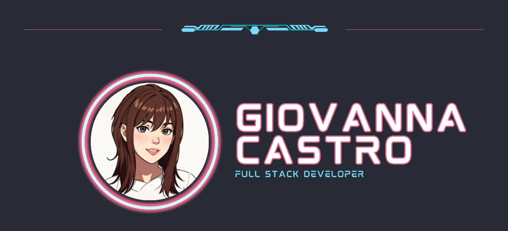

# Oi! Eu sou a Giih! 💻✨
- Sou uma engenheira de computação em ascensão
- Apaixonada por desafios e inovação
- Estudando constantemente para dominar o inglês
- Determinada a tornar-me uma profissional versátil
 
 

  
  
  

#

 
 
 

