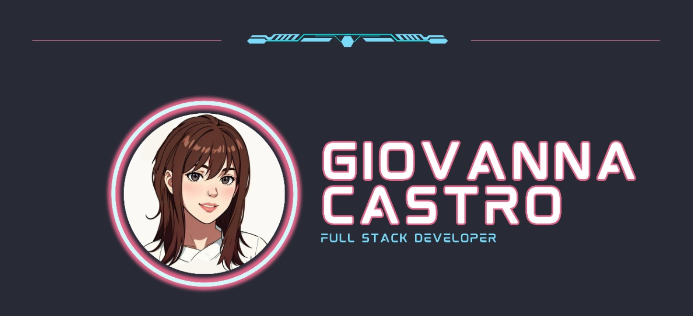

# Hello, World! I'm Giih! 💻✨
- Computer Engineering student, always curious and eager to learn  
- Passionate about challenges, innovation, and building meaningful solutions   
- Determined to grow into a versatile and high-impact professional  
 
 

  
  
  
  
  
  
  
  
  

#

 
 
 

